# 리눅스/Docker 퀴즈 게임

## 프로젝트 개요

터미널에서 동작하는 퀴즈 게임입니다.
리눅스 명령어, 파일 권한, Docker 기본 운영에 대한 퀴즈를 풀고, 새로운 퀴즈를 추가할 수 있습니다.
프로그램을 종료해도 퀴즈와 최고 점수가 유지됩니다.

## 퀴즈 주제 선정 이유

이전 미션(01-infra-basics-study)에서 학습한 내용을 복습하기 위해 선정했습니다.
`pwd`, `chmod`, `cat`, `mkdir`, `docker run` 등 실습했던 명령어와 개념을 퀴즈로 구성하여
학습 내용을 점검할 수 있도록 했습니다.

## 실행 방법

### Docker 환경 (권장)

```bash
# 이미지 빌드
./run.sh build

# 개발 쉘 진입
./run.sh shell

# 컨테이너 내부에서 실행
python main.py

# 또는 바로 게임 실행
./run.sh run
```

바인드 마운트 경로는 기본값이 현재 디렉터리이며, 변경 가능합니다:

```bash
./run.sh shell /path/to/project     # 인자로 지정
APP_DIR=/tmp/dev ./run.sh shell     # 환경변수로 지정
```

### 로컬 환경

```bash
python3 main.py
```

- Python 3.10 이상 필요
- 외부 라이브러리 불필요 (표준 라이브러리만 사용)

## 기능 목록

| 번호 | 기능 | 설명 |
|------|------|------|
| 1 | 퀴즈 풀기 | 랜덤 순서로 출제, 문제 수 선택 가능 (0=랜덤), 정답/오답 피드백, 중도 중단 시에도 기록 저장 |
| 2 | 퀴즈 추가 | 문제, 선택지 4개, 정답 번호를 입력하여 새 퀴즈 등록 |
| 3 | 퀴즈 목록 | 등록된 전체 퀴즈와 정답 확인 |
| 4 | 퀴즈 삭제 | 번호 선택으로 개별 퀴즈 삭제 |
| 5 | 점수 확인 | 최고 점수 및 최근 10건 게임 히스토리 조회 |
| 6 | 종료 | 데이터 저장 후 안전 종료 |

## 파일 구조

```
02-git-python-first-steps/
├── Dockerfile          # Python 3.12 + Git 개발 환경
├── run.sh              # Docker 실행 스크립트 (바인드 마운트)
├── main.py             # 프로그램 진입점
├── quiz.py             # Quiz 클래스 (개별 퀴즈 표현)
├── quiz_game.py        # QuizGame 클래스 (게임 전체 관리)
├── state.json          # 퀴즈 데이터 및 점수 저장 (자동 생성)
├── .gitignore          # Git 추적 제외 파일
└── README.md           # 프로젝트 설명
```

## 데이터 파일 설명

### state.json

프로젝트 루트에 자동 생성되며, 퀴즈 데이터와 최고 점수를 저장합니다.

- **경로**: 프로젝트 루트 `/state.json`
- **인코딩**: UTF-8
- **스키마**:

```json
{
  "quizzes": [
    {
      "question": "문제 텍스트",
      "choices": ["선택지1", "선택지2", "선택지3", "선택지4"],
      "answer": 1
    }
  ],
  "best_score": 3,
  "best_total": 5,
  "history": [
    {
      "date": "2026-04-03 15:30:00",
      "total": 5,
      "correct": 3
    }
  ]
}
```

| 키 | 타입 | 설명 |
|----|------|------|
| `quizzes` | list | 퀴즈 목록 |
| `quizzes[].question` | str | 퀴즈 문제 |
| `quizzes[].choices` | list[str] | 선택지 4개 |
| `quizzes[].answer` | int | 정답 번호 (1~4) |
| `best_score` | int \| null | 최고 점수 정답 수 (미풀이 시 null) |
| `best_total` | int \| null | 최고 점수 기록 당시 출제 문제 수. 정답률(`best_score/best_total`) 기준으로 비교하며, 동일 정답률이면 더 많은 문제를 푼 기록이 우선한다 |
| `history` | list | 게임 기록 목록 |
| `history[].date` | str | 풀이 일시 (YYYY-MM-DD HH:MM:SS) |
| `history[].total` | int | 출제 문제 수 |
| `history[].correct` | int | 정답 수 |

- 파일이 없으면 기본 퀴즈 5개로 자동 생성됩니다.
- 파일이 손상된 경우 안내 메시지 출력 후 기본 데이터로 복구됩니다.

## 설계 설명

### 클래스 구조

`Quiz`와 `QuizGame` 두 클래스로 역할을 분리했다.

- **Quiz**: 개별 퀴즈의 데이터와 동작(출력, 정답 확인, 직렬화)을 담당한다.
- **QuizGame**: 게임 전체 흐름(메뉴, 출제, 채점, 파일 저장/불러오기)을 관리한다.

클래스를 사용한 이유는 퀴즈 목록·점수·히스토리 등 여러 상태를 하나의 객체로 묶어 관리하고, 데이터와 동작을 함께 캡슐화하기 위해서다.

### 로직 분리 기준

프로그램의 로직을 **입력 처리**, **게임 진행**, **데이터 저장/불러오기** 세 영역으로 나누었다.

- **입력 처리(검증)**: `QuizGame`의 `_read_menu_choice()`, `_read_answer()`, `_read_quiz_count()`, `_read_text()` 등 `_read_*` 헬퍼 메서드가 담당한다. 사용자 입력을 받아 빈 값·문자·범위 밖 등을 검증한 뒤 정제된 값만 반환한다. 입력 규칙이 바뀌어도 헬퍼 메서드만 수정하면 게임 로직에 영향이 없다.
- **게임 진행**: `play()`, `add_quiz()`, `list_quizzes()`, `delete_quiz()`, `show_score()` 등 공개 메서드가 담당한다. 메뉴 선택에 따른 흐름 제어와 채점 로직을 처리하며, 입력값은 헬퍼에게 위임하고 저장은 `save()`에 위임한다.
- **데이터 저장/불러오기**: `QuizGame.save()`와 `load()`가 JSON 직렬화/역직렬화를 담당한다. 개별 퀴즈의 딕셔너리 변환 책임은 `Quiz.to_dict()`와 `Quiz.from_dict()`로 Quiz 클래스에 위임했다.

### 파일 입출력 (state.json)

- **저장 형식**: JSON (`ensure_ascii=False`, `indent=2`)
- **읽기**: 프로그램 시작 시 1회. 파일이 없거나 손상되면 기본 퀴즈 5개로 초기화한다.
- **쓰기**: 데이터 변경(퀴즈 풀기 완료/중단, 추가, 삭제) 시마다 즉시 저장한다.
- **종료**: 메뉴 종료 또는 Ctrl+C/EOF 시 `save()` 호출 후 안전 종료한다.

퀴즈 풀기 중 중단한 경우에도 그때까지의 결과를 기록한다(단, 한 문제도 풀지 않았으면 기록하지 않는다).

#### JSON을 선택한 이유

데이터 저장 형식으로 JSON을 선택한 이유는 다음과 같다.

1. **사람이 읽을 수 있는 텍스트 형식**이라 디버깅이나 수동 편집이 쉽다.
2. Python 표준 라이브러리(`json` 모듈)만으로 바로 사용할 수 있어 **외부 의존성이 없다**.
3. 딕셔너리·리스트와 자연스럽게 매핑되어 **변환 코드가 간결**하다.
4. 언어에 독립적인 key-value 구조이므로 다른 프로그램에서도 같은 데이터를 읽을 수 있다.

#### 예외 처리 (try/except)

파일 입출력은 프로그램이 통제할 수 없는 외부 영역이므로, 다양한 실패 상황에 대비해 `try/except`로 감싸야 한다. `load()` 메서드에서 대비하는 실패 케이스는 다음과 같다.

| 예외 | 발생 상황 |
|------|-----------|
| `json.JSONDecodeError` | 파일 내용이 유효한 JSON이 아닌 경우 (수동 편집 실수, 저장 중 강제 종료로 파일이 잘린 경우 등) |
| `KeyError`, `TypeError` | JSON 파싱은 성공했으나 구조가 예상과 다른 경우 (필드 누락, 타입 불일치 등) |
| `OSError` | 파일 권한 문제, 디스크 공간 부족 등 OS 수준의 오류 |

이러한 예외가 발생하면 프로그램을 중단시키지 않고 기본 퀴즈 데이터로 복구하여 정상 실행을 보장한다. 파일이 아예 존재하지 않는 첫 실행 상황은 `os.path.exists()`로 사전에 확인하여 예외 없이 처리한다.

### 최고 점수 기준

정답률(`correct/total × 100`, 소수점 첫째 자리) 기준으로 비교하며, 동일 정답률이면 더 많은 문제를 푼 기록이 우선한다.

## Git 워크플로우

### 브랜치 전략

`main` ← `develop` ← `feature/*` 3단계 구조를 사용했다.

```
main        안정적인 릴리스 버전
  └─ develop      기능 통합 테스트 브랜치
       ├─ feature/quiz-class      Quiz 클래스 정의
       ├─ feature/menu            메뉴 및 기본 구조
       ├─ feature/play-quiz       퀴즈 풀기
       ├─ feature/add-quiz        퀴즈 추가
       ├─ feature/quiz-list       퀴즈 목록
       ├─ feature/score           점수 확인
       ├─ feature/random-quiz     랜덤 출제 (보너스)
       ├─ feature/select-count    문제 수 선택 (보너스)
       ├─ feature/delete-quiz     퀴즈 삭제 (보너스)
       └─ feature/score-history   점수 히스토리 (보너스)
```

**브랜치를 분리하는 이유**: 각 기능을 독립된 브랜치에서 개발하면, 기능 A의 미완성 코드가 기능 B 개발에 영향을 주지 않는다. 또한 문제가 생긴 기능만 되돌릴 수 있어 안정성이 높아진다.

**병합(merge)의 의미**: feature 브랜치에서 완성된 기능을 develop에 병합하여 통합 테스트를 하고, 모든 기능이 안정적으로 동작하면 main에 병합하여 릴리스한다. 이 과정에서 Git이 변경 이력을 보존하므로, 언제 어떤 기능이 추가되었는지 추적할 수 있다.

### 커밋 컨벤션

- **접두어 규칙**: `Feat:` (기능 추가), `Fix:` (버그 수정), `Docs:` (문서 수정), `Chore:` (설정·빌드 등 기타) 접두어를 붙인다.
- **커밋 단위**: 하나의 커밋은 하나의 논리적 변경을 담는다. 예를 들어 `feature/play-quiz` 브랜치에서도 "퀴즈 출제 로직 구현"과 "정답 채점 및 결과 출력"을 별도 커밋으로 나누어, 변경 의도를 커밋 단위로 추적할 수 있게 했다.
- **메시지 언어**: 한국어로 작성하며, 무엇을 왜 변경했는지 간결하게 기술한다.

### 현재 설계의 한계와 개선 방향

#### 대용량 데이터

현재는 프로그램 시작 시 `state.json` 전체를 메모리에 올리고, 데이터 변경 시마다 전체를 다시 파일에 쓴다. 퀴즈가 수십 개 수준이면 문제없지만, 1000개 이상으로 늘어나면 다음과 같은 한계가 생긴다.

- 매번 전체 파일을 직렬화/역직렬화하므로 **읽기·쓰기 비용이 선형으로 증가**한다.
- 파일 크기가 커지면 메모리 사용량도 함께 늘어난다.
- 특정 퀴즈만 조회하거나 검색하는 기능이 필요할 때 **인덱싱이 불가능**하다.

이 경우 SQLite 같은 경량 DB를 도입하면 부분 읽기/쓰기와 인덱싱이 가능해져 성능 문제를 해결할 수 있다. SQLite도 Python 표준 라이브러리(`sqlite3`)로 사용할 수 있어 외부 의존성 없이 전환할 수 있다.

#### 데이터 손상 대비

현재는 `state.json`이 손상되면 기본 퀴즈로 초기화하므로, 사용자가 추가한 퀴즈와 점수 기록이 모두 사라진다. 데이터를 보호하려면 다음과 같은 방법을 적용할 수 있다.

1. **백업 파일**: 저장 전에 기존 파일을 `state.json.bak`으로 복사해 두고, 새로 쓴 파일이 정상인지 확인한 뒤 백업을 삭제한다. 손상이 감지되면 백업에서 복구한다.
2. **원자적 쓰기**: 임시 파일(`state.tmp`)에 먼저 쓴 뒤 `os.replace()`로 원본을 교체한다. 쓰기 도중 강제 종료되어도 원본 파일은 손상되지 않는다.

## 스크린샷

### 환경
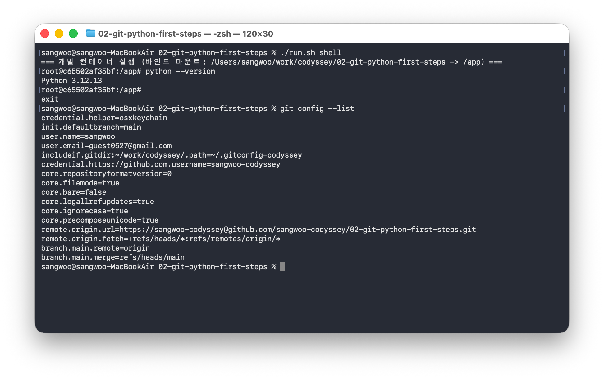

### 메뉴
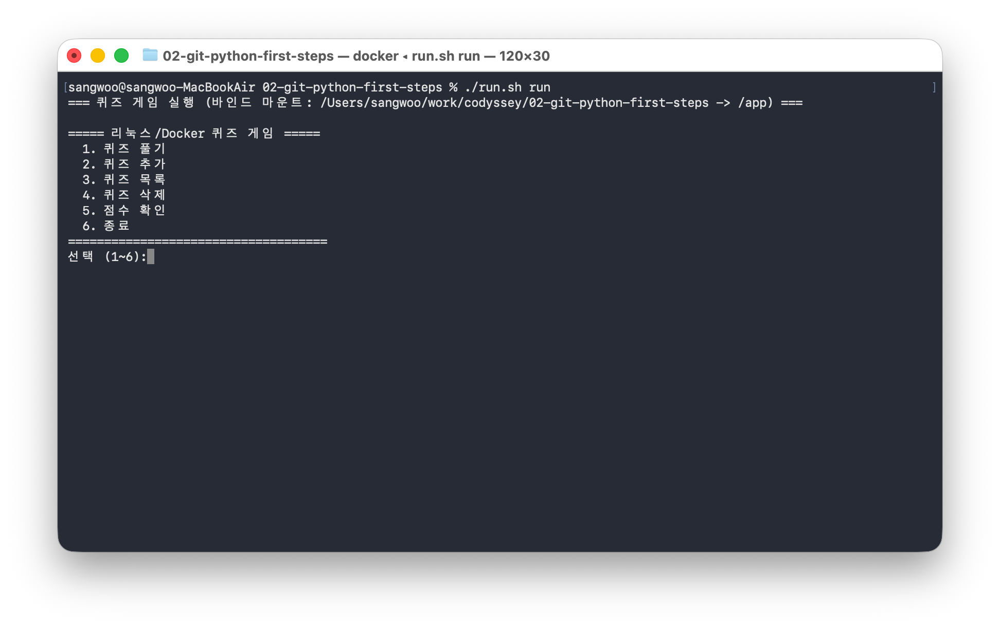

### 퀴즈 풀기
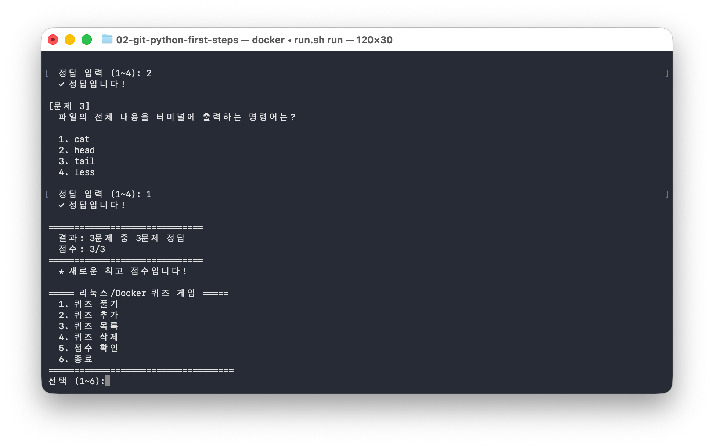

### 퀴즈 추가
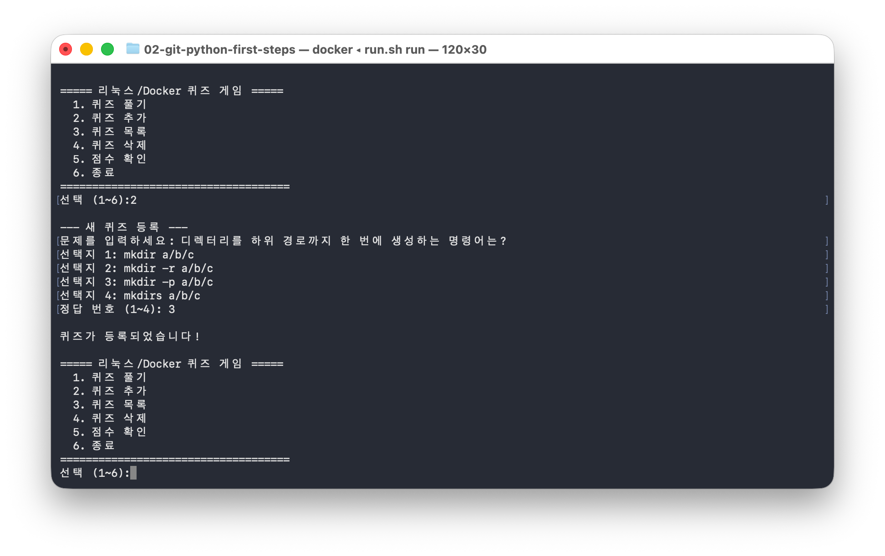

### 퀴즈 목록
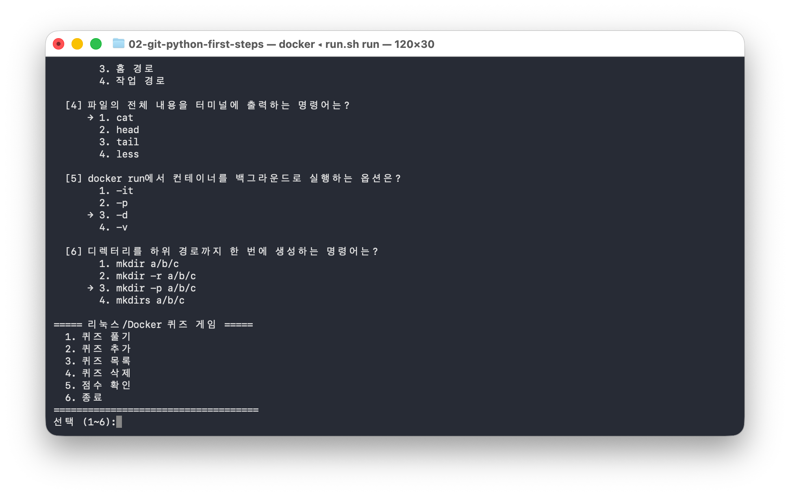

### 퀴즈 삭제
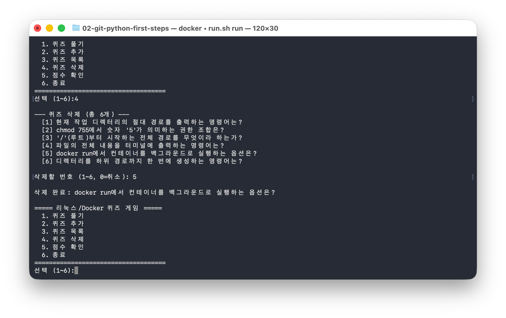

### 퀴즈 삭제 결과
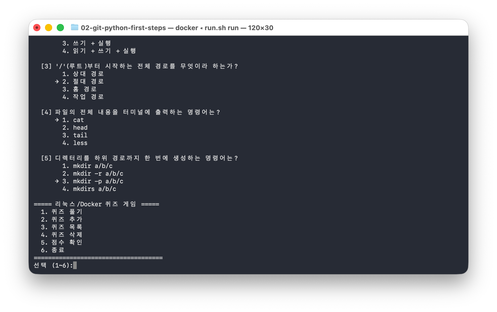

### 점수 확인
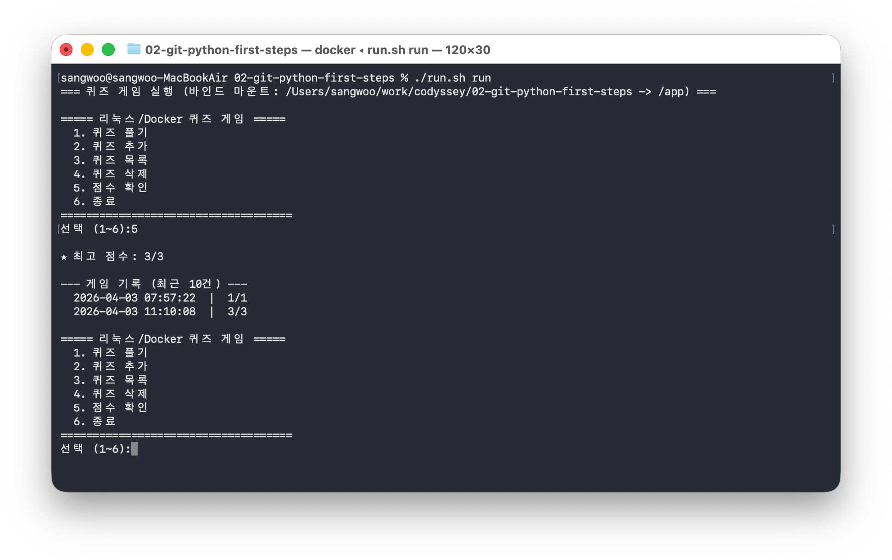

### 데이터 유지
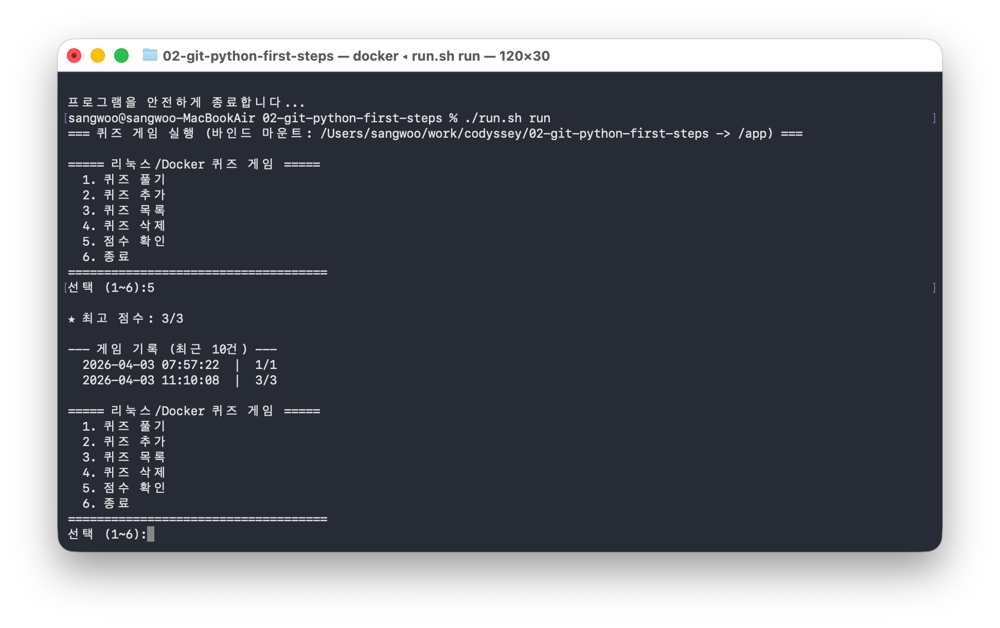

### 잘못된 입력 처리
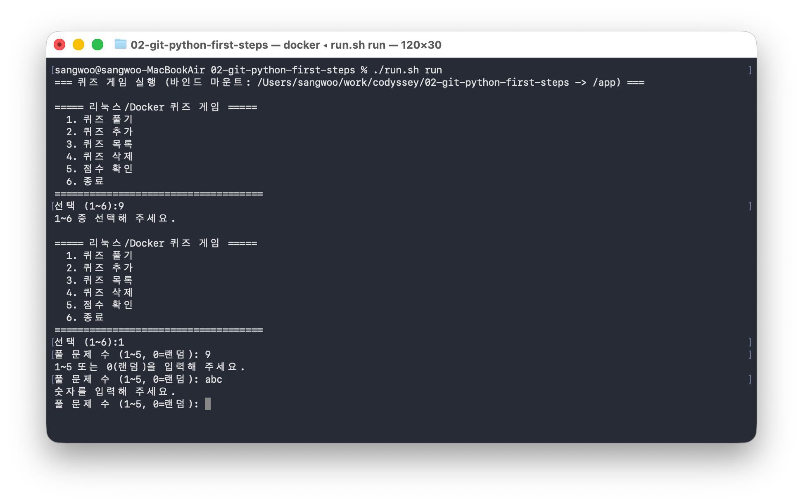

### Git 로그
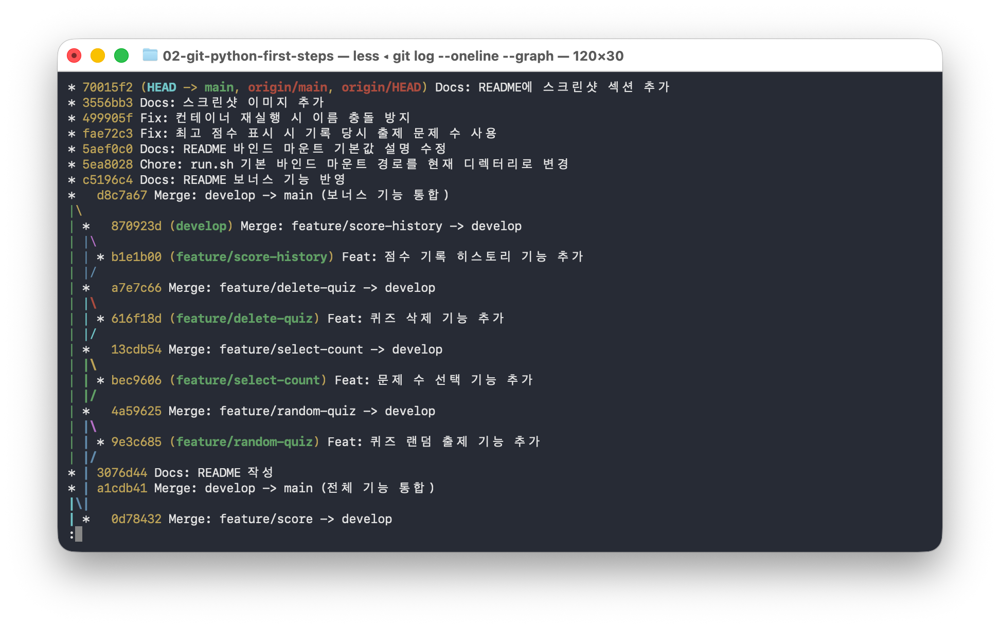

### Git Clone 실습
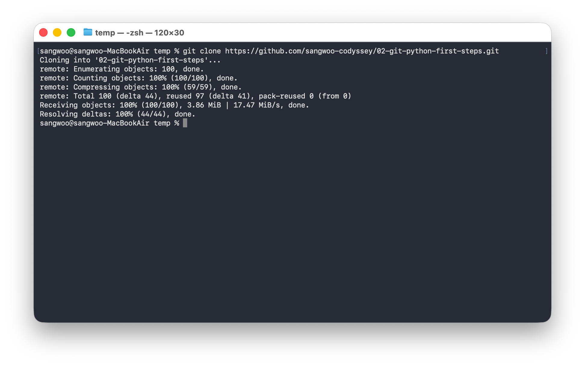

### Git Pull 실습
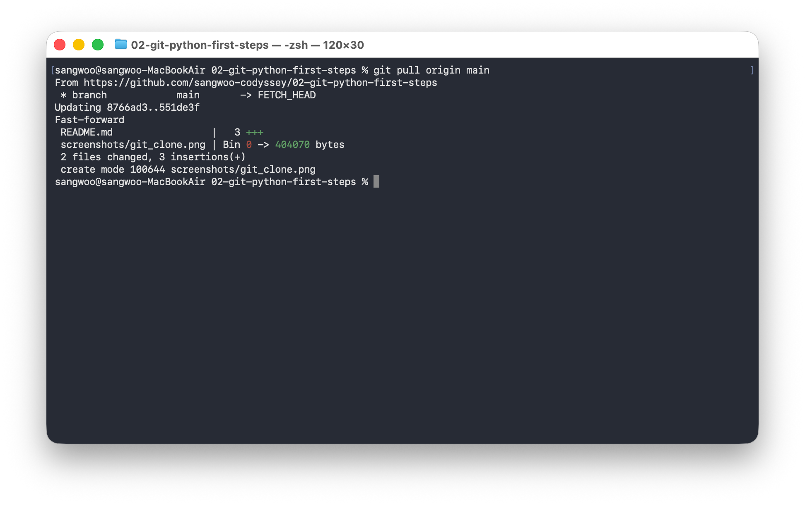

## Git 저장소

- https://github.com/sangwoo-codyssey/02-git-python-first-steps
